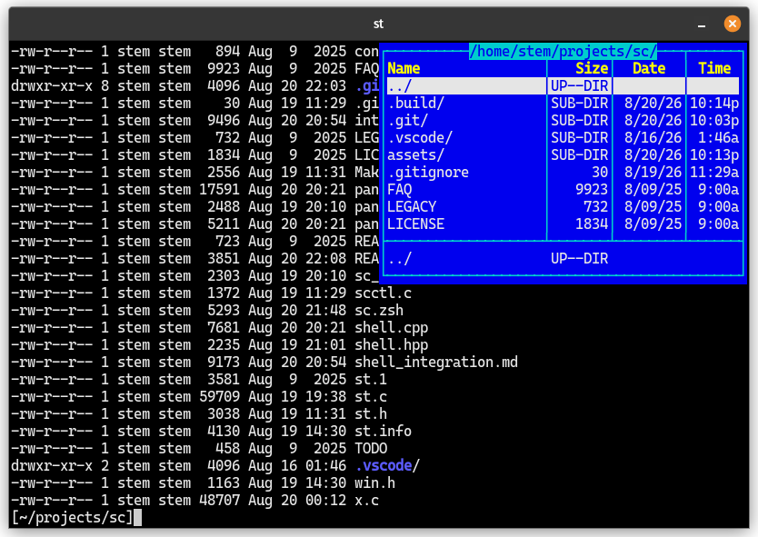

# SC — Simple Commander

SC is an NC (Norton Commander)-inspired terminal emulator for Linux. Built directly on top of [st](https://st.suckless.org/), it operates as a full terminal - not an application running inside one - meaning you close it simply by typing `exit`. It adds a keyboard-driven directory panel over the terminal screen that follows your shell's current directory, allowing you to seamlessly browse files without ever leaving the command line.



## SC and Midnight Commander

Midnight Commander (MC) is a full-screen file manager: it takes over the
terminal and supplies its own two-pane interface. SC is different. It is a
terminal overlay, not a program running inside the terminal. Your shell keeps
its normal prompt, command history, scrollback, and editable command line.

SC currently has one panel in the top-right portion of the terminal. A
two-panel layout is planned. The panel appears while the shell owns the
terminal and hides automatically when a child program, such as an editor or
pager, takes control.

## Install

SC needs an X11 session, zsh, and the normal build dependencies for `st`:
Xlib, Xft, Fontconfig, and FreeType.

Build and launch it from the repository:

```sh
make
./.build/sc
```

To install `sc`, its zsh integration, and the `scctl` helper, run:

```sh
make install
```

The default install prefix is `/usr/local`. Use the appropriate privileges if
your system requires them, or set `PREFIX` when invoking `make install`.

## Configure the required zsh integration

SC requires zsh and its adapter. After installing, add this after your prompt
or theme setup in `~/.zshrc`:

```zsh
if [[ -n ${SC_SOCKET-} ]]; then
  export SCCTL=/usr/local/bin/scctl
  source /usr/local/share/sc/sc.zsh
fi
```

If you installed to another prefix, change both paths. Then close and reopen
SC. The condition ensures the required bindings load only in zsh instances
started by SC.

## Use the panel

The panel needs a terminal at least 80 columns wide and 12 rows high. It shows
the current directory, placing directories before files. Each entry includes
its name, size or directory marker, modification date, and time.

Press `Ctrl+O` to show or hide the panel. When it is visible:

| Key | Action |
| --- | --- |
| `Up` / `Down` | Move the selection |
| `Home` / `End` | Go to the first / last entry |
| `Page Up` / `Page Down` | Move by one page |
| `Ctrl+Page Up` | Change to the parent directory |
| `Ctrl+Page Down` | Change to the selected directory |
| `Ctrl+Enter` | Insert the selected name at the command cursor |
| `Ctrl+Shift+Enter` | Insert the selected full path at the command cursor |
| `F3` | View the selected entry with `less` |
| `F4` | Edit the selected entry with `vi` |
| `Enter` | Run the typed command, or act on the selected entry |

SC consumes only keys that apply to the current panel layout. Keys that are not
applicable, such as `Tab` when only one panel is shown or `Up` when the panels
are hidden, pass through to the shell and retain their normal shell behavior.

With an empty command line, `Enter` changes into a selected directory. For a
selected file, it places the shell-quoted path on the command line and runs it.
When a command is already being edited, `Enter` behaves normally and runs that
command. When the panel is hidden, `Enter` always retains its normal shell behavior,
including accepting an empty line.

Function-key actions such as `F3` and `F4` are configurable in `sc.zsh` through
the `SC_USER_COMMANDS` associative array near the top of the file. A standalone `{}`
argument is replaced with the selected entry's absolute path; if `{}` is absent, the
path is appended to the configured command.

## Community patches

This project does not apply any patches from https://st.suckless.org/patches/. Users can apply them as necessary.

Recommended patches:
  * https://st.suckless.org/patches/boxdraw/ : box lines become crisp and hard-edged pixel primitives.
  * https://st.suckless.org/patches/csi_22_23/ : save and restore window title (for instance nvim does this when opening and closing)

## Current scope

SC is a local-filesystem navigator. It does not yet include file copy/move
commands, archive or VFS support, or mouse file management.

## License

See [LICENSE](LICENSE).
